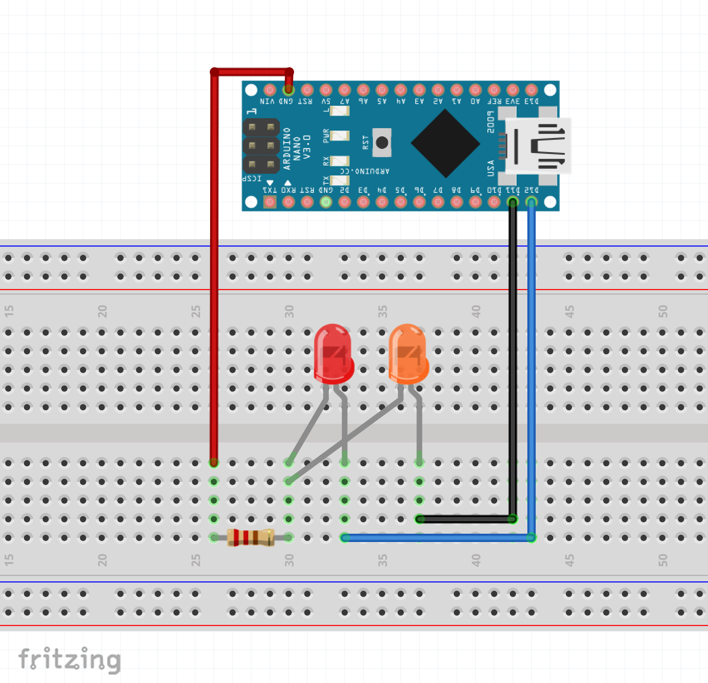

# Conditional_LED_Sets

if connect VCC to A0 both LEDs will turn off.
else if connect VCC to A1, the first LED will turn on and the second one will turn off.
else if connect VCC to A2, the first LED will turn off and the second one will turn on.
else if connect VCC to A3 both LEDs will turn on.

